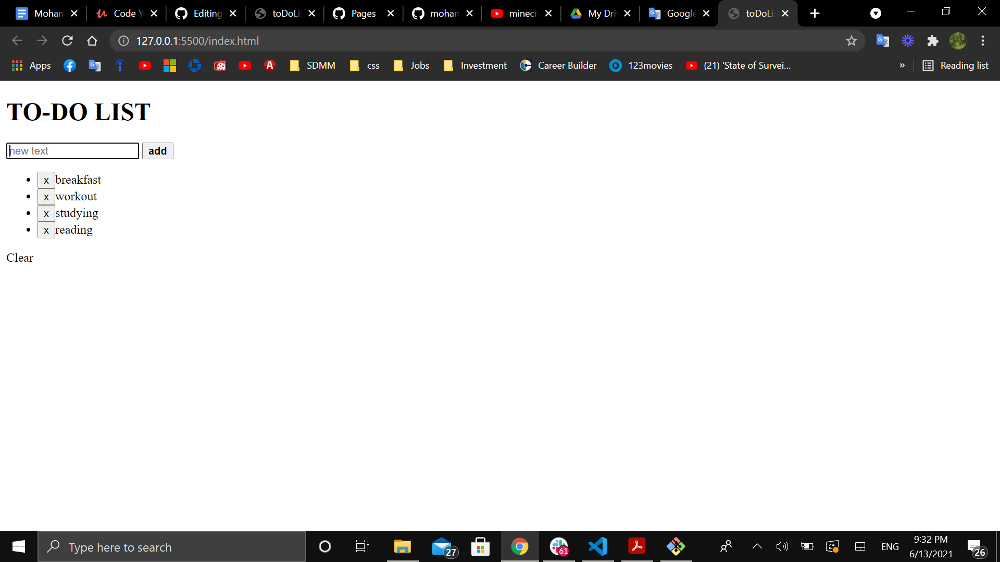

# Vanilla JavaScript To-Do-App 

#### A simple To-Do-App written entirely in Javascript, HTML, and CSS.

#### Play it [here](https://mohammedq91.github.io/To-Do-App/)

## Summary

After I enrolled in software development mentorship program back in March 2021, I was able to actually start building my first real world project (Digital Clock). Having a structured roadmap along with mentors' guidance, I quickly started to realize the importance of the baby steps needed to write each line of code and following along with what the logic is intented to do.

In this project, I learned how several topics are being used in Javascript (i.e template literals, declaring a funcation, calling a function, storing date into a variable, const vs let vs var, conditional statement, and method vs property).

## Author

- **Mohammed Qaralos** - *Self taught Software Developer* - [Website](http://127.0.0.1:5500/index.html) | [LinkedIn](https://www.linkedin.com/in/mohammed-qaralos-27151010a/)
